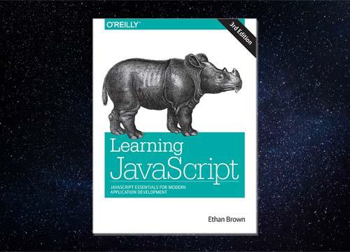

<h1 align="center">
   
  
   
  
thankYouEthanBrown

</h1>

TODO: Put more badges here.

> This is a tracker of my JS learning progress with [Ethan Brown`s](https://github.com/EthanRBrown) &#39;Learning JavaScript 3rd edition&#39; During the read I put the code examples from each book chapter into a respective repository folders. Short notes, new terms and other noteworthy pieces of information were stored in this file. I hope you find these useful.
> ☝ **NOTE: You should never rely on someone else`s notes and read this book on your own. But it might be a good idea to check underwritten bullets to find something you are yet unfamiliar with.**

**📖 Contents:** 

- [Chapter1](#Chapter1)
- [Chapter2](#Chapter2)
- [Chapter3](#Chapter3)
- [Chapter4](#Chapter4)
- [Chapter5](#Chapter5)
- [Chapter6](#Chapter6)
- [Chapter7](#Chapter7)
- [Chapter8](#Chapter8)
- [Chapter9](#Chapter9)
- [Chapter10](#Chapte10)
- [Maintainers](#maintainers)
- [Contributing](#contributing)
- [License](#license)

## Chapter1

## Chapter2

## Chapter3

## Chapter4

## Chapter5

## Chapter6

## Chapter7

## Chapter8

## Chapter9

## Chapter10

## Maintainers

[@skrikl](https://github.com/skrikl)

## Contributing

PRs accepted.

Small note: If editing the README, please conform to the [standard-readme](https://github.com/RichardLitt/standard-readme) specification.

## License

MIT © 2019 Sergey Kriklivyy
