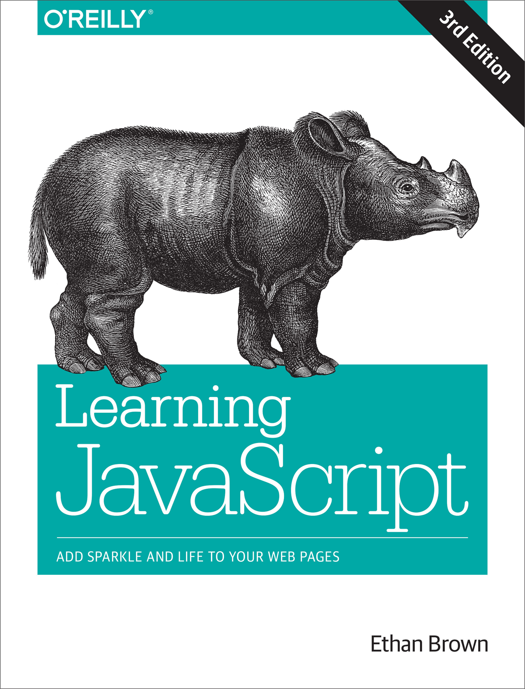
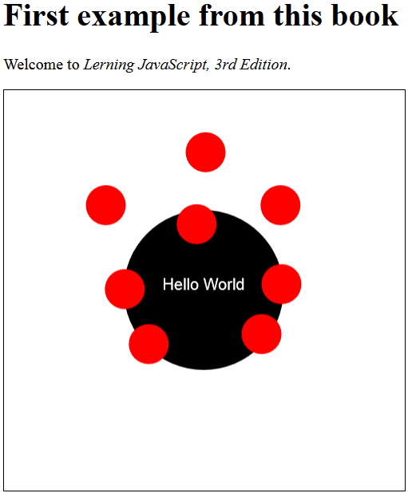
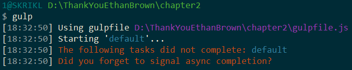
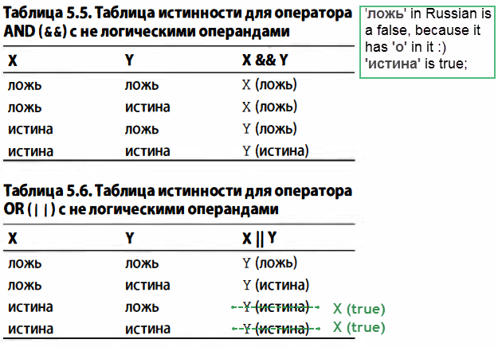
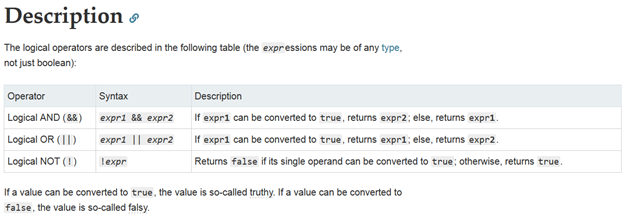

<h1 align="center">
   
  
   
  
thankYouEthanBrown

</h1>

This is a tracker of my JS learning progress with [Ethan Brown's](https://github.com/EthanRBrown) &#39;Learning JavaScript 3rd edition&#39; During the read, I put the code examples from each book chapter into respective repository folders. Short notes, new vocabulary and other noteworthy pieces of information were stored in this file. I hope you find these useful.

> ☝ **NOTE: You should never rely on someone else's notes and read this book on your own. But it might be a good idea to check underwritten bullets to find something you are yet unfamiliar with. Things, that look `like this` below can be used as a markers: if you are uncertain what the marked term(technology, web resource, person, book, etc.) means, then it could be a good idea to read the respective chapter of the book and/or google that term to know more.**

**📖 Contents:** 

- [Chapter1](#chapter1)
- [Chapter2](#Chapter2)
- [Chapter3](#Chapter3)
- [Chapter4](#Chapter4)
- [Chapter5](#Chapter5)
- [Chapter6](#Chapter6)
- [Chapter7](#Chapter7)
- [Chapter8](#Chapter8)
- [Chapter9](#Chapter9)
- [Chapter10](#Chapte10)
- [Maintainers](#maintainers)
- [Contributing](#contributing)
- [License](#license)

## Chapter1
1.  JavaScript is not Java. It is a realization of the ECMAScript language.
ECMAScript 6 (ES6) was published in June 2015 and was also referenced as `"Harmony"`, `"ES2015"` or `"ECMAScript2015"`.
2.  ES6 is basically `syntax sugar` over ES5 which really had a lot of changes over the previous standard. Nevertheless, ES6 features help coder a lot and fix several issues present in language earlier.
3.  `'use strict'` directive is not a command, nor a function or an object. It is just a string that tells your browser to slightly change its behavior while parsing and running the code. It does not 'switch on' the ES6 syntax.
4.  You can use a transpiler to automatically convert your ES6 code to older syntax if you need it for compatibility reasons.
5.  This book was not created to cover all aspects of ES6 in detail, some other good references are `Mozilla Developer Network`, or `JavaScript: The Definitive Guide by David Flanagan` (it does not cover ES6 now, but as for May 2019 some chapters of the new revision are available on Amazon as early access).
6.  Choose a good code editor to support you during the way. Most of the modern editors go with some useful features like syntax highlighting, words autocompletion and more.
7.  Before you know what you are doing be extremely attentive to each symbol you type from the source. You will definitely waste half an hour one day because of one wrong semicolon.
8.  Put your CSS in the header 
    `<link  rel="stylesheet" href="main.css">`
Put your scripts to the end of the body by default. There are several reasons for this, that will be discussed later
    ``
9.  Open dev tools with F12 in most of the browsers. If you go to console then, use `<Ctrl+Shift+K>` to shorten the way.
10. CDNs aka content delivery networks is an easy way to include public JS libraries to your project. We will use jQuery and PaperJS in this chapter's example. Yes, jQuery is as old as you, but it is still commonly used and a lot of tools are based on it. 
11. Boilerplate is just a repetitive standard piece of code that you use to set up things like PaperJS or other external libraries.
12. Asynchronous events are the ones that happen without your control. The user decides to click, or external script finishes work - you never know **exactly** when the event happens. As easy as that.
13. The result of this chapter's exercise looks more or less like this: 

## Chapter2

1.  'Coding' involves not only the code editor and a coding language. You should know about things like:
`git` - version control system
`node` - go with npm and let you execute JS code without a browser
`GULP` - project builder
`Babel` - transcompiler
`ESLint` - linter
2.  Do you know command shell essentials?
    `pwd`
    `ls`
    `mkdir`
    `cd`
    `cd ..`
3.  Do you know git essentials?
    `git init`
    `.gitignore`
    `git status`
    `git add -A`
    `git commit -m "I know how to commit"`
    `git push`
    `git log`
4.  Do you know Node essentials?
    `node -v`
    `npm -v`
    `npm install` [packageName] [--options]
    `package.json`
    `npm install`
5.  Modules, that you install using npm (or yarn as an alternative) are called dependencies of your project. You use a package manager to download all the dependencies automatically.  
6.  You use GULP to do a lot of repetitive tasks like running a list of commands one by one several time a day in an easy way. It might be scary to start using it, but after you invest a day in it completing tutorials and trying things out, you will like it. 
7.  There are common project structure principles to follow. Do not put all your files in one folder.
8.  As coding practice in this chapter you will:
    `Initialize npm in project folder`
    `Install GULP as dev-dependancy`
    `Create GULP tasks` (check bullet 9. for an explanation of 'dependency' word used in the book's example)
    `Start the task manager from comand shell` (check bullet 10. for a possible solution for a error you might get at this step)
9.  NOTE Dependencies of the whole project **as files** will be downloaded by npm. We put it in gulpfile.js as well to be able to use these with GULP **as JS external libraries**.
10. Ethan seems to be using gulp3 while writing the book and following the book's instructions you will get gulp4 from npm with a slightly different approach to callback functions. The result may be the following:
  
To make it work add (cb) to the task functions (you can check the gulpfile example in chapter2 folder). There are different methods to provide a correct callback in gulp4, check gulp documentation and search for 'callback' keyword to learn why's and how's.

## Chapter3

1.  Data types are abstractions over 'zeroes and ones' to represent numbers, strings, dates and so on.
2.  Data storage mechanisms include `variables, constants, and literals`. 
3.  There are `primitive` immutable data types and mutable `objects`. Number, String, and Boolean are primitives, though all of these have respective built-in object companions in JavaScript. Null, Undefined and Symbol are primitives as well. All the rest are objects. 
4.  `О.1 + О.2 = О.30000000000000004`
5.  Number as an object has some neat features: `Number.EPSILON`, Number.MAX_VALUE, Number.MIN_SAFE_INTEGER and more.
6.  const s = "In JavaScript, use \\ as an `escape character` in strings";
7.  `Template string` is:  
let currentTemp = 21.5;  
const message = `` ` ``The current temperature is `$`{currentTemp}\u00b0C`` ` ``;
8.  3 + '30' = '330';  
3 * '30' = 90;
9.  Symbols are ES6 update, each symbol is unique which is good for identifiers for example. `const RED = Symbol();`
10. When in doubt prefer `null` over `undefined`.
11. An object is a container and its contents are subject to change (contents change, but the object is the same). Contents of objects are called `object members or properties`. 
12. There is `computed member access` option in case you need 'bad' property names in your object.  
Example:  
`myobject[invalid spacing in name]` = "Still valid key, though cannot be accessed using a standard .dot operator";
13. A function can be added to an object as ordinary key-value pair. Key will be that function name, value - function body.
14. Delete property with `delete objectName.objectProperty`;
15. Number, String, and Boolean data types seem to have properties because, after a call, a temporary object of a respective type is created. You can assign a property to a primitive with no visible error because that property will be assigned to a temporary object. Still, this data will be lost as the object is destroyed immediately after the call.
16. An array is a special object with a fixed order of elements. Arrays can contain an element of any data type. Example:  
<pre>
const arr = ['true',  
              false,  
              null,  
              {1: 'Even objects!'},  
];
</pre>
17. A regular expression or `regex` is a syntax for search/replace operations in strings.  
`const email = /\b[a-z0-9._-]+@[a-z_-]+(?:\.[a-z]+)+\b/;`.
18. Convert strings to numbers using `Number(); parseInt(); parseFloat();`.
19. Convert  all JS objects to strings using `.toString();` method
20. Convert all values to boolean using `!!` or `Boolean();`.
21. There was no coding exercise in this chapter.

## Chapter4

1.  `Flowchart` is a visual representation of the program workflow. 
2.  In this chapter you can consider `truthy === true` and `falsy === false`. More coming in chapter 5.
3.  When you add { and } in your JS code you create a `block statement or compound statement`. 
4.  Generally, indents do not affect interpreter, however correct indentation is essential for clean, readable code.  
5.  Remember that `` console.log(`a string with ${something}`);`` will return the value of `something` but `console.log('a string with ${something}');` won't. **Some revisions of the book have ' instead of ` in the code examples.**
6.  Control program flow with conditions (if...else, switch), loops (while, do...while, for), and special operators (break, continue, return, throw). 
7.  `Metasyntax` is used in the book to describe program flow in this chapter. It is also used in Mozilla Developer Network.
8. Cycle  `for([initialization]; [condition]; [final_expression]) {operators}` works this way: initialization -> check condition -> execute operators -> execute fina expression -> check condition and so on.
9.  Switch operator's cases inside the function can be written with returns instead of breaks.
10. `for ... in` and `for ... of` cycles are good for iteration in objects and arrays.
11. Use return or break to avoid unnecessary calculations.
12. Remember that `let i = 0;` inside for cycle will make `i` not visible after the cycle.
13. Use `decreasing index` to loop through an array when you modify the array in the same loop. Array modification can change the exit conditions or you can even skip elements because indexes changed. 
14. In this chapter, you create 'Crown and Ancor' game to practice program flow control. The code can be found in the chapter4 folder.

## Chapter5 

1.  False in JS:  
    `
    - undefined
    - null
    - false
    - 0
    - NaN
    - '' empty string`
2.  Logical operators in JS works not only with logical typed of data; moreover, the `returned value can also be different from logical type`.
3.  Empty array `arr = [];` is true, use `arr.length` instead when you need an empty array to be false. 
4.  Prefer strict equality over abstract equality. Two values are strictly equal when they link to the same object or have the same type and value (for base types). 
5.  Checking equality of non-integer numbers may fail because of the limited accuracy of numbers like 0.1.
6.  \+ operator is used as a sum and as a concatenation. 
7.  `(x || y) && x !== y` is equivalent to XOR logical operator.
8.  `Short-circuit evaluation` is used by JS when the first argument in logical expression immediately gives the answer. For example in (x && y) when x has false it does not matter what value y has.
9.  Be attentive at table 5.6. Some revisions of the book have an error in it.  
  Refer to MDN for a good short explanation:  

10. p.122 example before table 5.9 can also be incorrect. Comma operator will not work as intended. Try this instead:  
`<pre>
const arr = [3, 5, 8, 11, 4, 13, 1];
let n, i=0;

while((n = nums[i]) < 10 && i++ < nums.length) {
  console.log(`Number less than 10: ${n}.`);
}
console.log(`Number greater than 10 found: ${n}.`);
console.log(`${nums.length - i} numbers remain.`);
</pre>`
11. = operator is also an expression, so it returns the assigned value, which makes chain assignment possible `let x = y = "both x and y gets this string"`;
12. `Destructuring assignment` lets you to assign individual elements of an object or the array to separate variables.
13. Destructuring assignment makes value exchange possible without a temporary variable.  
`let a = 5, b = 10;  
[a, b] = [b, a];`
14. There was no coding exercise in this chapter.

## Chapter6
1.  Function is a set of operators, that can be called using that function name folowed by a set of parenthesis. Functions form a kind of subprograms in your code. Each function has a body - set of operators, that are executed as a single block of instructions.
2.  A function call is an expression, so it returns a `function's return value`. 
3.  Formal arguments of a function get values after a function call and become `actual arguments`. Actual arguments are simular to the variables, but exist only inside the function. 
4.  Base types are `value type`. When you assign these variables to other variables using =, you `copy the value` to the new variable. Objects are `reference type` and a link to the object is copied to a new variable or  transfered to a function.
5.  Destructured function argument allows to use object's elements as function arguments.  
<pre>
function getSentence({subject, verb, object}) 
  return `${subject} ${verb} ${object}`;
const о = {subject:  "I", 
           verb:  "love",
           object:  "JavaScript",
};
getSentence(o); // "I love JavaScript" 
</pre> 
6.  Wnen a function is an object property it is called this object's `method`.
7.  
8.  
9.  
10. 
11. 
12. 
13. 
14. 

## Chapter7
1.  
2.  
3.  
4.  
5.  
6.  
7.  
8.  
9.  
10. 
11. 
12. 
13. 
14. 

## Chapter8
1.  
2.  
3.  
4.  
5.  
6.  
7.  
8.  
9.  
10. 
11. 
12. 
13. 
14. 

## Chapter9
1.  
2.  
3.  
4.  
5.  
6.  
7.  
8.  
9.  
10. 
11. 
12. 
13. 
14. 

## Chapter10
1.  
2.  
3.  
4.  
5.  
6.  
7.  
8.  
9.  
10. 
11. 
12. 
13. 
14. 

## Maintainers

[@skrikl](https://github.com/skrikl)

## Contributing

PRs accepted.

Small note: If editing the README, please conform to the [standard-readme](https://github.com/RichardLitt/standard-readme) specification.

## License

MIT © 2019 Sergey Kriklivyy
